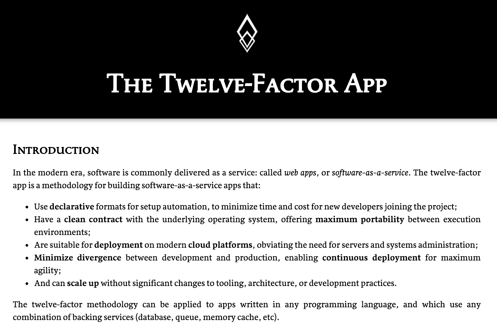
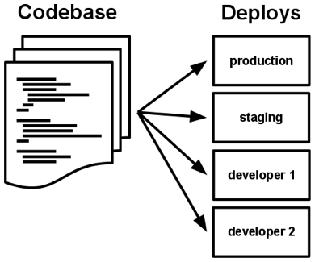
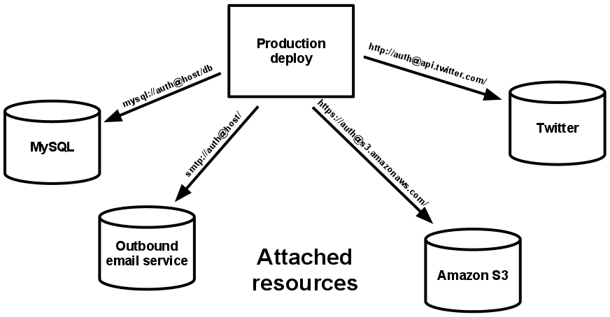
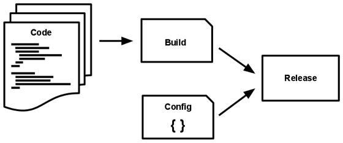
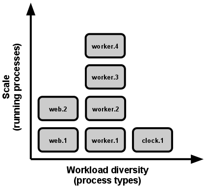

footer: © 2015 Matt Stine
slidenumbers: true

# [fit] Building
# [fit] 12 Factor
# [fit] JVM Applications

---


# Me

Matt Stine [@mstine](http://twitter.com/mstine)
Senior Product Manager
Pivotal
[matt.stine@gmail.com](mailto:matt.stine@gmail.com)

---


# [fit] http://12factor.net

---

# Patterns

- Cloud-native application architectures
- Optimized for speed, safety, & scale
- Declarative configuration
- Stateless/shared-nothing processes
- Loose coupling to application environment

---


# [fit] http://heroku.com

---


# [fit] http://cloudfoundry.org

---


# [fit] http://docker.com

---


# [fit] Microservices!

---


# [fit] _Microframeworks_
# [fit] Dropwizard
# [fit] Spring Boot

---

# Dropwizard
- [http://dropwizard.io](http://dropwizard.io)
- Library | Framework
- GOAL: Meet "production-ready" web app needs.
- Jetty / Jersey / Jackson
- Metrics: [http://metrics.dropwizard.io/](http://metrics.dropwizard.io/)

---

`HelloWorldConfiguration`

```java
public class HelloWorldConfiguration extends Configuration {
  @NotEmpty
  private String template;

  @NotEmpty
  private String defaultName = "Stranger";

  @JsonProperty
  public String getTemplate() { return template; }

  @JsonProperty
  public void setTemplate(String template) { this.template = template; }

  @JsonProperty
  public String getDefaultName() { return defaultName; }

  @JsonProperty
  public void setDefaultName(String name) { this.defaultName = name; }
}
```

---

`HelloWorldResource`

```java
@Path("/hello-world")
@Produces(MediaType.APPLICATION_JSON)
public class HelloWorldResource {
    private final String template;
    private final String defaultName;
    private final AtomicLong counter;

    public HelloWorldResource(String template, String defaultName) {
        this.template = template;
        this.defaultName = defaultName;
        this.counter = new AtomicLong();
    }

    @GET
    @Timed
    public Saying sayHello(@QueryParam("name") Optional<String> name) {
        final String value = String.format(template, name.or(defaultName));
        return new Saying(counter.incrementAndGet(), value);
    }
}
```

---

`Saying`

```java
public class Saying {
    private long id;

    @Length(max = 3)
    private String content;

    public Saying() {}

    public Saying(long id, String content) {
        this.id = id;
        this.content = content;
    }

    @JsonProperty
    public long getId() { return id; }

    @JsonProperty
    public String getContent() { return content; }
}
```

---

`TemplateHealthCheck`

```java
public class TemplateHealthCheck extends HealthCheck {
    private final String template;

    public TemplateHealthCheck(String template) { this.template = template; }

    @Override
    protected Result check() throws Exception {
        final String saying = String.format(template, "TEST");
        if (!saying.contains("TEST")) {
            return Result.unhealthy("template doesn't include a name");
        }
        return HealthCheck.Result.healthy();
    }
}
```

---

`HelloWorldApplication`

```java
public class HelloWorldApplication extends Application<HelloWorldConfiguration> {
    public static void main(String[] args) throws Exception {
        new HelloWorldApplication().run(args);
    }

    @Override
    public String getName() { return "hello-world"; }

    @Override
    public void initialize(Bootstrap<HelloWorldConfiguration> bootstrap) {
        bootstrap.setConfigurationFactoryFactory(new EnvironmentConfigurationFactoryFactory());
    }

    @Override
    public void run(HelloWorldConfiguration configuration,
                    Environment environment) {
        final HelloWorldResource resource = new HelloWorldResource(
                configuration.getTemplate(),
                configuration.getDefaultName()
        );
        final TemplateHealthCheck healthCheck =
                new TemplateHealthCheck(configuration.getTemplate());
        environment.healthChecks().register("template", healthCheck);
        environment.jersey().register(resource);
    }
}
```

---

`hello-world.yml`

```haml
template: $env:TEMPLATE:Hello, %s!
defaultName: $env:DEFAULT_NAME:Stranger
```

---

# [fit] DEMO

---

# Spring Boot
- [http://projects.spring.io/spring-boot](http://projects.spring.io/spring-boot)
- Opinionated convention over configuration
- Production-ready Spring applications
- Embed Tomcat, Jetty or Undertow
- *STARTERS*
- Actuator: Metrics, health checks, introspection

---

# [http://start.spring.io](start.spring.io)


---

`HelloWorldController`

```java
@RestController("/hello-world")
public class HelloWorldController {

    private final String template;
    private final String defaultName;
    private final AtomicLong counter;

    @Autowired
    public HelloWorldController(@Value("${template}") String template, @Value("${default.name}") String defaultName) {
        this.template = template;
        this.defaultName = defaultName;
        this.counter = new AtomicLong();
    }

    @RequestMapping(method = RequestMethod.GET, produces = "application/json")
    public Saying sayHello(@RequestParam(value = "name", required = false) String name) {
        final String value = String.format(template, (name != null) ? name : defaultName);
        return new Saying(counter.incrementAndGet(), value);
    }
}
```

---

`Saying`

```java
public class Saying {
    private long id;

    @Length(max = 3)
    private String content;

    public Saying() {}

    public Saying(long id, String content) {
        this.id = id;
        this.content = content;
    }

    @JsonProperty
    public long getId() { return id; }

    @JsonProperty
    public String getContent() { return content; }
}
```

---

`TemplateHealthCheck`

```java
@Component
public class TemplateHealthCheck implements HealthIndicator {

    private final String template;

    @Autowired
    public TemplateHealthCheck(@Value("${template}") String template) {
        this.template = template;
    }

    @Override
    public Health health() {
        final String saying = String.format(template, "TEST");
        if (!saying.contains("TEST")) {
            return Health.down().withDetail("error", "template doesn't include a name").build();
        }
        return Health.up().build();
    }
}
```

---

`HelloSpringBootApplication`

```java
@SpringBootApplication
public class HelloSpringBootApplication {

    public static void main(String[] args) {
        SpringApplication.run(HelloSpringBootApplication.class, args);
    }
}
```

---

`application.yml`

```haml
template: Hello, %s!
default:
  name: Stranger
```

---

# [fit] DEMO

---

> I. Codebase
-- One codebase tracked in revision control, many deploys

---

# [fit] What you already do (_right?_).

---

# [fit] Multiple Codebases
# [fit] _=_
# [fit] Distributed System

---

# [fit] Shared Code
# [fit] _=_
# [fit] Shared Library

---



---

> II. Dependencies
-- Explicitly declare and isolate dependencies

---

# [fit] What you already do (_right?_).

---

# Declarative Dependency Management

- Gradle
- Maven
- Ant/Ivy
- Etc.

---

# [fit] _Never_
# [fit] Assume
# [fit] Anything is There

---

# [fit] Carry
# [fit] _Everything_
# [fit] You Need

---

- Spring Boot Jar Apps
- Dropwizard Maven Shade Jar Apps

---

> III. Config
-- Store config in the environment

---

# What is configuration?

- Resource handles to databases and other backing services
- Credentials to external sources (e.g. S3, Twitter, ...)
- Per-deploy values (e.g. canonical hostname for deploy)
- ANYTHING that’s likely to vary between deploys (dev, test, stage, prod)

---

# Where NOT to store it:

- In the CODE (Captian Obvious)
- In PROPERTIES FILES (That’s code...)
- In the BUILD (ONE build, MANY deploys)
- In the APP SERVER (e.g. JNDI datasources)

---

# [fit] Store it in the
# [fit] ENVIRONMENT!

---

# When am I done?

When "...the codebase could be made open source at any moment, without compromising any credentials."

---

# Why Environment Variables?

- Easy to change
- Little chance of being “checked in” to VCS
- Language/OS-agnostic standard

---

> IV. Backing Services
-- Treat backing services as attached resources

---



---

# [fit] _No_ Distinction
# [fit] Between
# [fit] Local and 3rd Parties

---

# [fit] Always
# [fit] Swappable!

---

# [fit] Enabled by
# [fit] Externalized
# [fit] Config

---

> V. Build, release, run
-- Strictly separate build and run stages

---

# Build

Produce a deployable artifact with all dependencies bundled in.

---


# [fit] Maven/Gradle Build

---

# Release

Combine a deployable artifact with configuration and system runtime components (e.g. the JRE).

---


# [fit] Docker Build

---

# Run

Start one or more processes from a specific release.

---


# [fit] Docker Run

---



---

# [fit] _IMMUTABILITY_

---

> VI. Processes
-- Execute the app as one or more stateless processes

---


# [fit] Elasticity

---


# [fit] Ephemerality

---

# Why is State a Problem?

- Disappears with App Container Recycle
- No Shared Memory
- No Persistent or Shared Disk (Usually)

---

# Usual Suspects

- Sessions
- In-App Caches
- Stateful Frameworks (JSF, WebFlow)

---

# Solutions

- Externalize In-Memory State
- Use Persistent Object Stores

---

# [fit] Spring
# [fit] Session
# [fit] [http://projects.spring.io/spring-session](http://projects.spring.io/spring-session)

---

`Config`

```java
@EnableRedisHttpSession
public class Config {

    @Value("${redis.hostname}")
    String hostName;

    @Value("${redis.port}")
    int port;

    @Bean
    public JedisConnectionFactory connectionFactory() {
        JedisConnectionFactory factory = new JedisConnectionFactory();
        factory.setHostName(this.hostName);
        factory.setPort(this.port);
        return factory;
    }
}
```

---

# `Initializer`

```java
public class Initializer
        extends AbstractHttpSessionApplicationInitializer {

    public Initializer() {
        super(Config.class);
    }
}
```

---

# [fit] Then use
# [fit] `HttpSession`
# [fit] Like Always!

---

> VII. Port binding
-- Export services via port binding

---

# [fit] Bring Your Own
# [fit] _Container_

---

# Containers

- Tomcat (SB)
- Jetty (SB, DW)
- Undertow (SB)

---

# [fit] Not Only
# [fit] _HTTP_

---


# [fit] Docker Port Binding
[https://docs.docker.com/userguide/dockerlinks/](https://docs.docker.com/userguide/dockerlinks/)

---

> VIII. Concurrency
-- Scale out via the process model

---

# [fit] _MOAR_ Processes
# [fit] Less Multiplexing

---



---


# [fit] _NANO_services?

---

# [fit] Horizontal
# [fit] _Scale Out_
# [fit] Architecture

---

# [fit] _Delegate_
# [fit] Process Management

^ Operating System, Cloud Platform, Foreman, etc.

---

> IX. Disposability
-- Maximize robustness with fast startup and graceful shutdown

---

# [fit] Start _NOW_?
# [fit] Stop _NOW_?
# [fit] NO PROBLEM

^ fast elastic scaling
^ rapid deployment of code or config changes
^ robustness of production deploys.

---

# [fit] _Minimize_
# [fit] Start Up Time

---


# [fit] Microservices!

---

# [fit] _Graceful_
# [fit] Shutdown

^ Stop listening, allow requests to finish, exit
^ Workers - return current job to work queue (RMQ NACK)
^ Idempotency

---

# [fit] _CRASH_
# [fit] Well

---

> X. Dev/prod parity
-- Keep development, staging, and production as similar as possible

^ Historically, there have been substantial gaps between development (a developer making live edits to a local deploy of the app) and production (a running deploy of the app accessed by end users).

---

# [fit] _Time_
# [fit] Gap

^ A developer may work on code that takes days, weeks, or even months to go into production.

^ Weeks vs. Hours

___

# [fit] _People_
# [fit] Gap

^ Developers write code, ops engineers deploy it.

^ Different vs. Same

___

# [fit] _Tools_
# [fit] Gap

^ Developers may be using a stack like Nginx, SQLite, and OS X, while the production deploy uses Apache, MySQL, and Linux.

^ Divergent vs. Similar

___

# [fit] Lean Toward
# [fit] _Identical_
# [fit] Backing Services

---


# [fit] Docker!

^ Never been easier to use the real thing!

---

> XI. Logs
-- Treat logs as event streams

---

# [fit] _STOP_
# [fit] Managing
# [fit] Log Files!

---

# [fit] STDOUT
# [fit] _STDERR_

---

# [fit] _Dev:_
# [fit] Log Tails

---

# [fit] _Prod:_
# [fit] Log Capture

---

# Capture / Aggregate:

- Logplex [https://github.com/heroku/logplex](https://github.com/heroku/logplex)
- Fluent [https://github.com/fluent/fluentd](https://github.com/fluent/fluentd)

---

# Index / Analyze:

- Splunk [http://splunk.com](http://splunk.com)
- Logstash [http://logstash.net](http://logstash.net)

---

> XII. Admin processes
-- Run admin/management tasks as one-off processes

---

# Things like:

- Database Migrations
- Console / REPL
- One-off Scripts

---

# Same:

- Environment (ship admin code!)
- Dependency Isolation (Maven/Gradle)

---

# [fit] Spring Boot
# [fit] _Shell_ Demo

---

# Thanks!

_Matt Stine_ ([@mstine](http://twitter.com/mstine))

* _This Presentation:_ https://github.com/mstine/nfjs_2015/tree/master/BuildingTwelveFactorApps

---

# Credits

* _The Twelve-Factor App_: http://12factor.net/
* _Elasticity_: http://www.flickr.com/photos/karen_d/2944127077
* _Ephemerality_: http://www.flickr.com/photos/smathur/852322080
