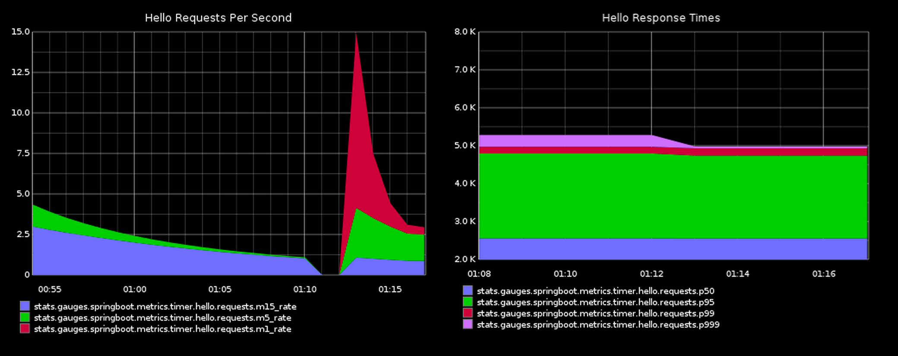
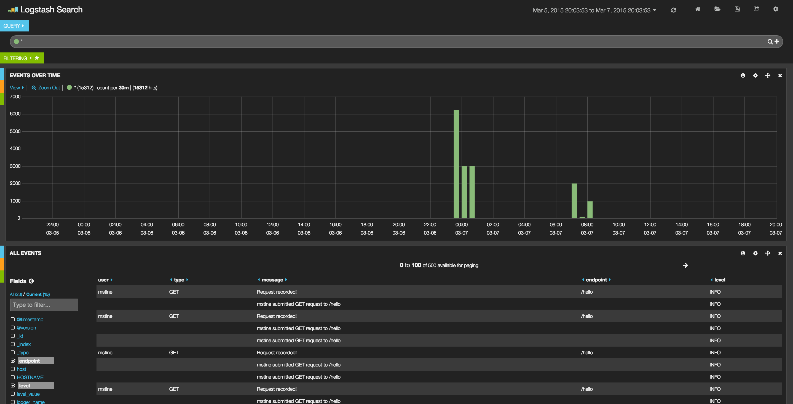
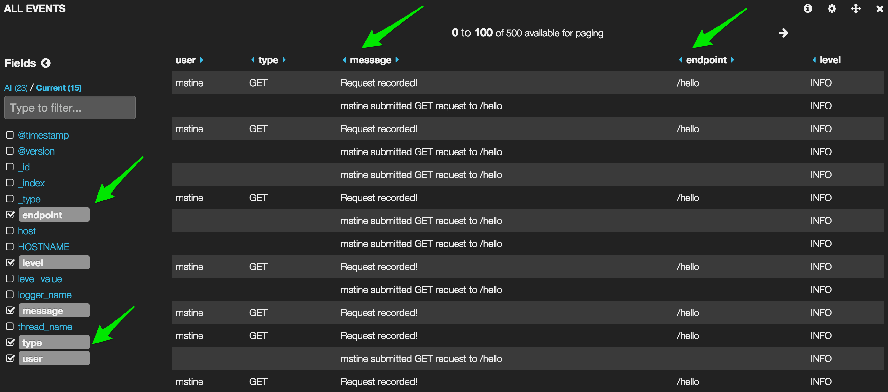
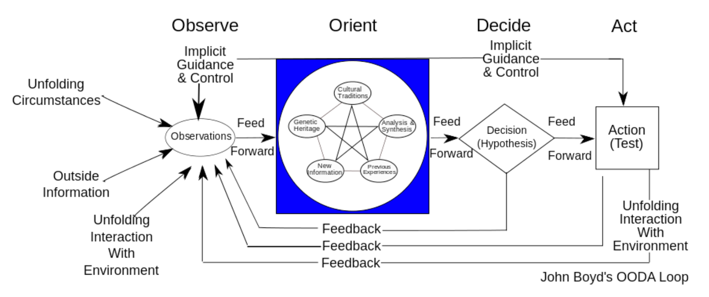

footer: © 2015 Matt Stine
slidenumbers: true

# [fit] Monitoring
# [fit] and Metrics
# [fit] and Logging
# [fit] _**Oh My!**_

---


# Me

Matt Stine [@mstine](http://twitter.com/mstine)
Senior Product Manager
Pivotal
[matt.stine@gmail.com](mailto:matt.stine@gmail.com)

---


# I wrote a little cloud book...

FREE - Compliments of Pivotal

[http://bit.ly/cloud-native-book](http://bit.ly/cloud-native-book)

---

# [fit] _VISIBILITY_

---

# [fit] How does our code
# [fit] _**EVEN WORK**_?

---

# [fit] WE _DON'T_
# [fit] KNOW_!_

---

# [fit] Performance
# [fit] Misbehavior
# [fit] _**Failure**_???

---

# [fit] BUSINESS
# [fit] _VALUE_

---

# [fit] What even is
# [fit] _**NORMAL**_?

---

# [fit] MEASURE
# [FIT] _EVERYTHING_

---

# But what about?

---

# [fit] NO SERIOUSLY...
# [fit] MEASURE
# [FIT] _EVERYTHING_

---

# [fit] Why?

---

> Mind the gap.
-- Coda Hale

---

# Mind the Gap?

```java
map != territory

perception != reality

mentalModel.of(theCode) != theCode
```

---

# [fit] Make
# [fit] _BETTER_
# [fit] Decisions

---

# [fit] Create
# [fit] _MOAR_
# [fit] Business Value

---

# [fit] PROFIT!

---

# [fit] HOW?

---

# [fit] Metrics
# [fit] Logging
# [fit] Monitoring

---

# [fit] Metrics

# _Measure the stuff we care about as quantitative values._

---

# [fit] Dropwizard
# [fit] _Metrics_
# [fit] [https://dropwizard.github.io/metrics](https://dropwizard.github.io/metrics)

---

# [fit] Gauges

# _An instantaneous value of something._

---

# Gauge Example

```java
@RequestMapping("/hello/{name}")
public String hello(@PathVariable("name") String name) {
   storeName(name);
   return "Hello " + name + "!";
}
```

Number of times a particular name has been stored.

---

# Gauge Example

```
gauge.matts
             value = 42
```

---

# [fit] Counters

# _Incrementing or decrementing the value of something._

---

# Counter Example

```java
@RequestMapping("/addJob")
public String addJob() {
    jobs.inc();
    // Add Job to Queue
    return "added";
}

@RequestMapping("/removeJob")
public String removeJob() {
    jobs.dec();
    // Remove Job from Queue
    return "removed";
}
```

Monitor the size of a queue.

---

# Counter Example

```
counter.jobs
             count = 53
```

---

# [fit] Meters

# _An average rate of events over a period of time._

---

# Meter Example

```java
@RequestMapping("/hello")
public String hello() {
  helloRequests.mark();

  return "Hello World!";
}
```

Requests/second for `/hello`

---

# Meter Example

```
meter.hello.requests
             count = 1998
         mean rate = 0.09 events/second
     1-minute rate = 3.83 events/second
     5-minute rate = 2.48 events/second
    15-minute rate = 1.01 events/second
```

^ we care about "recency" - what is process doing right now

^Exponentially weighted moving average

^ smoothing factor affects sensitivity

---

# [fit] Histograms

# _A statistical distribution of values in a stream of data._

---

# Histogram Example

```java
@RequestMapping("/cities/{contains}")
public Iterable<City> citySearch(@PathVariable("contains") String contains) {
    final Page<City> results = cityRepository.findByNameContainsIgnoreCase(contains, new PageRequest(0, 10));
    searchResultHistogram.update(results.getTotalElements());
    return results;
}
```

Results returned from a search query.

---

# Histogram Example

```
histogram.search.results
             count = 16
               min = 1
               max = 2870
              mean = 282.17
            stddev = 612.35
            median = 79.00
              75% <= 310.00
              95% <= 479.00
              98% <= 2870.00
              99% <= 2870.00
            99.9% <= 2870.00
```

^ We can't keep all of this...

^ Reservoir sampling -- statistically representative sample of stream of data

^ Forward-decaying priority sampling - maintaing statistically rep sample of last 5 minutes

---

# [fit] Timers

# _A *histogram* of durations and a *meter* of calls._

---

# Timer Example

```java
@RequestMapping("/hello")
public String hello() {
  final Timer.Context context = helloTimer.time();
  try {
    Thread.sleep(random.nextInt(5000));
    return "Hello World!";
  } catch (InterruptedException e) {
    throw new RuntimeException(e);
  } finally {
    context.stop();
  }
}
```

Requests/second and response times for `/hello`.

---

# Timer Example

```
timer.hello.requests
             count = 8195
         mean rate = 7.52 calls/second
     1-minute rate = 2.05 calls/second
     5-minute rate = 6.17 calls/second
    15-minute rate = 5.02 calls/second
               min = 3.14 milliseconds
               max = 4993.54 milliseconds
              mean = 2558.33 milliseconds
            stddev = 1395.31 milliseconds
            median = 2596.78 milliseconds
              75% <= 3692.99 milliseconds
              95% <= 4775.20 milliseconds
              98% <= 4890.06 milliseconds
              99% <= 4939.16 milliseconds
            99.9% <= 4985.91 milliseconds
```

---

# [fit] Spring Boot
# [fit] _Metrics_
# [fit] [http://bit.ly/spring-boot-metrics](http://bit.ly/spring-boot-metrics)

---

# Spring Boot `/metrics` Endpoint

```json
{
  mem: 164864,
  mem.free: 84272,
  processors: 8,
  uptime: 28987,
  instance.uptime: 25305,
  systemload.average: 2.8408203125,
  heap.committed: 164864,
  heap.init: 262144,
  heap.used: 80591,
  heap: 3728384,
  threads.peak: 213,
  threads.daemon: 211,
  threads: 213,
  classes: 5732,
  classes.loaded: 5732,
  classes.unloaded: 0,
  gc.ps_scavenge.count: 24,
  gc.ps_scavenge.time: 108,
  gc.ps_marksweep.count: 4,
  gc.ps_marksweep.time: 467,
  counter.status.200.metrics: 2,
  gauge.response.hello: 1,
  gauge.response.metrics: 2,
  counter.status.200.hello: 300,
  httpsessions.max: -1,
  httpsessions.active: 0
}
```

---

# [fit] Logging

# _Record the stuff we care about qualitative values._

---

# [fit] Just Like We
# [fit] _Measure_
# [fit] Everything

---

# [fit] Log
# [fit] _ANYTHING_
# [fit] That May Be Useful for Analysis

---

# Log Levels

- *TRACE* - only during dev, never commit!
- *DEBUG* - for debugging, but committed.
- *INFO* - user-driven or system actions.
- *NOTICE* - notable, non-error events.

---

# MOAR Log Levels

- *WARN* - something bad could be happening!
- *ERROR* - something bad did happen!
- *FATAL* - pack up and go home.

---


# [fit] `try`
# [fit] `catch`
# [fit] `log`
# [fit] `rethrow`

---

# [fit] _Human_
# [fit] Readable

---

# Human Readable (SLF4J)

```java
logger.info("{} submitted {} request to {}", "mstine", HttpMethod.GET, "/hello");
```

```
<TS> mstine submitted GET request to /hello
```

---

# [fit] _CONTEXT_

---

# [fit] Part of Your
# [fit] _API_?

---

# [fit] _SEMANTIC_
# [fit] Logging
# [fit] _Give it a schema..._

---

# [fit] Key/Value
# [fit] Pairs

---

# [fit] JSON

---

# Semantic Logging (SLF4J)

```java
logger.info(append("endpoint", "/hello")
  .and(append("type", HttpMethod.GET))
  .and(append("user", "mstine")),
  "Request recorded!");
```

```json
{
  "@timestamp":"2015-03-07T06:46:24.005+00:00",
  "message":"Request recorded!",
  "logger_name":"com.mattstine.mmlom.StatsdGraphiteDemoApplication",
  "thread_name":"http-nio-8080-exec-183",
  "level":"INFO",
  "endpoint":"/hello",
  "type":"GET",
  "user":"mstine",
  "host":"192.168.99.1:52720"
}
```

---

# [fit] Monitoring

# Actively _and_ passively _observing the things we measure and record._

---

# [fit] _Shipping_
# [fit] Our Metrics and Logs

---

# [fit] _Metrics_
# [fit] StatsD +
# [fit] Graphite

---

# StatsD

- simple NodeJS daemon
- listens for messages via UDP port
  - fast
  - fire-and-forget
- ubiquitous metrics shipper
- https://github.com/etsy/statsd/

---

# Graphite

- easy to use
- powerful graphing / data manipulation capabilities
- works well with StatsD and other shippers
- http://graphite.wikidot.com/

---

# Our Metrics in Graphite



---

# SHIP IT!

```java
@Bean
StatsDReporter statsDReporter() {
    return StatsDReporter.forRegistry(metricRegistry)
            .prefixedWith("springboot.metrics")
            .build("192.168.99.100", 8125);
}

@Override
public void run(String... strings) throws Exception {
    statsDReporter().start(10, TimeUnit.SECONDS);
}
```

https://github.com/ReadyTalk/metrics-statsd

---

# [fit] _STOP_
# [fit] Managing
# [fit] Log Files!

---


# [fit] _Logs_
# [fit] E_lasticsearch_
# [fit] L_ogstash_
# [fit] K_ibana_

---

# ELK Stack

LogStash
- Log Shipper / http://logstash.net

Elasticsearch
- Indexer / http://www.elasticsearch.org

Kibana
- UI / http://www.elasticsearch.org/overview/kibana

---

# Our Logs in Logstash


---

# ZOOM IN


---

# SHIP IT!

```xml
<configuration>
    <appender name="LOGSTASH" class="net.logstash.logback.appender.LogstashTcpSocketAppender">
        <remoteHost>192.168.99.100</remoteHost>
        <port>10042</port>
        <encoder class="net.logstash.logback.encoder.LogstashEncoder" />
    </appender>

    <root level="INFO">
        <appender-ref ref="LOGSTASH" />
    </root>
</configuration>
```

https://github.com/logstash/logstash-logback-encoder

---

# [fit] INSTALL IT


---

# With Docker Compose

```haml
graphite:
  image: hopsoft/graphite-statsd
  ports:
   - "80:80"
   - "2003:2003"
   - "8125:8125/udp"
logstash:
  image: pblittle/docker-logstash
  environment:
   - LOGSTASH_CONFIG_URL=https://raw.githubusercontent.com/mstine/statsd-graphite-demo/master/logstash.conf
  ports:
   - "10042:10042"
   - "9292:9292"
   - "9200:9200"
```

---

# [fit] Parting
# [fit] Thoughts

---

# OODA Loop - John Boyd


---

# Observe

>What is the 99% latency of our service right now?

*~500 ms*

---

# Orient

>How does this compare to other parts of our system, both currently and historically?

*~50 ms last night - way slower*

---

# Decide

>do we make it faster? Or should we add feature X?

*MAKE IT FASTER*

---

# Act

*WRITE SOME CODE*

---

# [fit] If we do this
# [fit] _FASTER_
# [fit] we will
# [fit] _WIN!_

---

# Thanks!

_Matt Stine_ ([@mstine](http://twitter.com/mstine))

* _This Presentation:_ [https://github.com/mstine/nfjs_2015/tree/master/MonitoringMetricsLogging](https://github.com/mstine/nfjs_2015/tree/master/MonitoringMetricsLogging)
